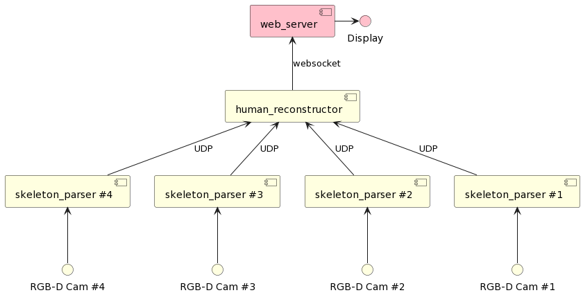

# seamless-mocap
This project aims to provide a solution for 3D human-pose reconstruction in realtime.

## pre-requisite
### EasyMocap
<https://github.com/zju3dv/EasyMocap/blob/master/doc/installation.md>

EasyMocap is an open-source toolbox for markerless human motion capture from RGB videos. In this project, we provide a lot of motion capture demos in different settings.

### Zed SDK
<https://www.stereolabs.com/developers/release/>

ZED SDK 3.6 introduces a major improvement in the Object detection module, custom detector inputs can be ingested into the SDK to have 3D detection and tracking from 2D bounding box. A new model that detects the person heads for improve accuracy in crowded environments. It now also supports ZED2/2i and ZED Mini.

## overview
### system architecture
Skeleton parsers estimate 2D body keypoints from RGB image and transfer it to a human reconstructor via HTTP.

Then, the human reconstructor receives 2D body keypoints respectively and reconstruct 3D human model.

